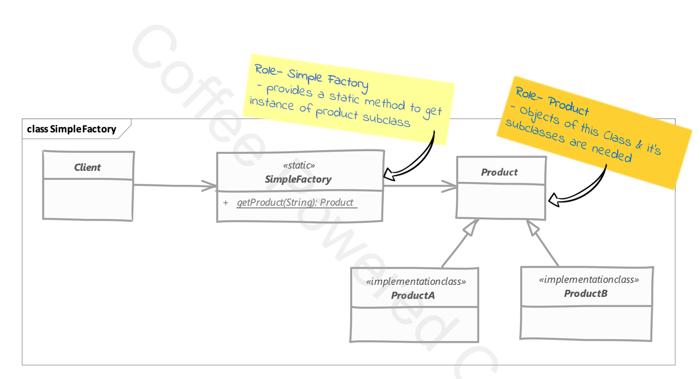
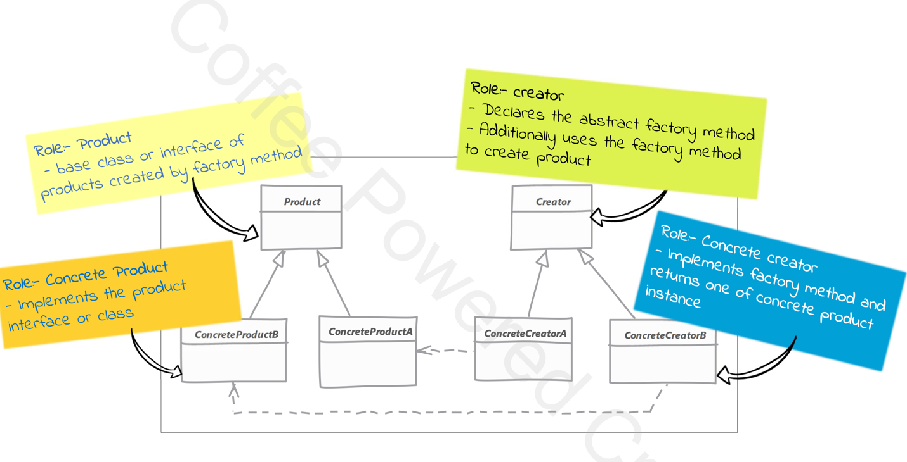
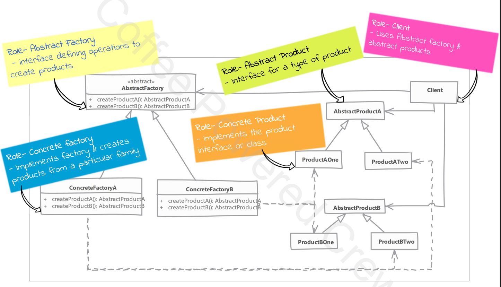

Learning record of java design patterns

# Builder Pattern

# Factory
## Simple Factory
Here we simply move the instantiation logic to a separate class and most commonly to a static method to this class.
Some do not consider _Simple Factory_ to be a 'design pattern', as it's simply  a method that encapsulates object instantiation.
Nothing complex goes on in the method.
We are studying _Simple Factory_ as it is often confused with "Factory Method" pattern.

java.text.NumberFormat.getInstance is an example of Simple Factory

## Factory Method

a real example of _Factory Method_ is java.util.Collection.iterator() method

## Abstract Factory

Abstract Factory makes use of factory method pattern. You can think of abstract factory as an object with multiple factory methods.

## Singleton
Eager Singleton / Lazy Singleton / Enum Singleton
java.lang.Runtime is a singleton
In eager singleton implementation the singleton instance is created as soon the singleton class is referenced.